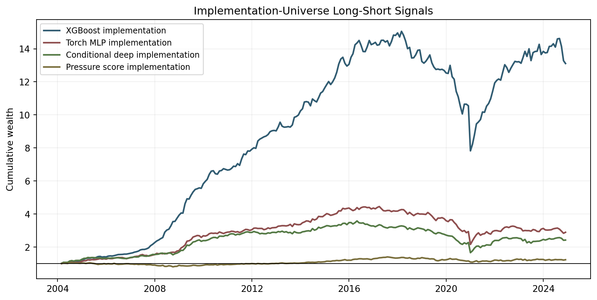
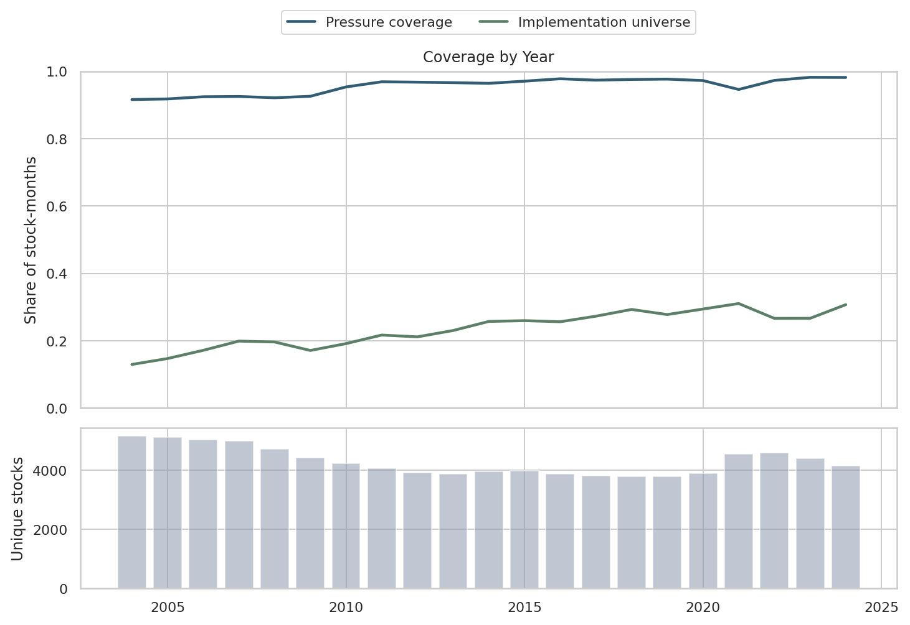
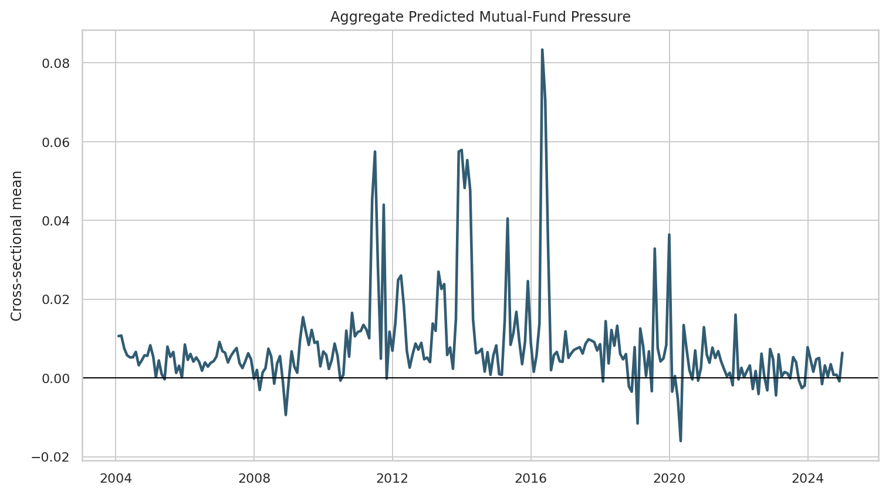
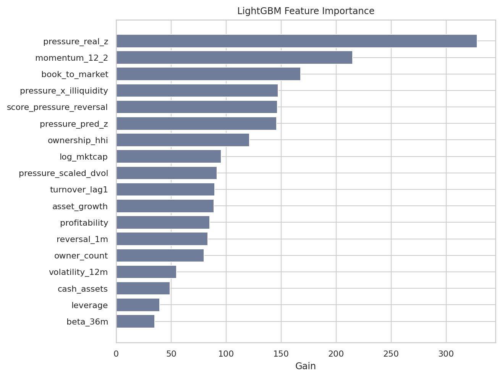
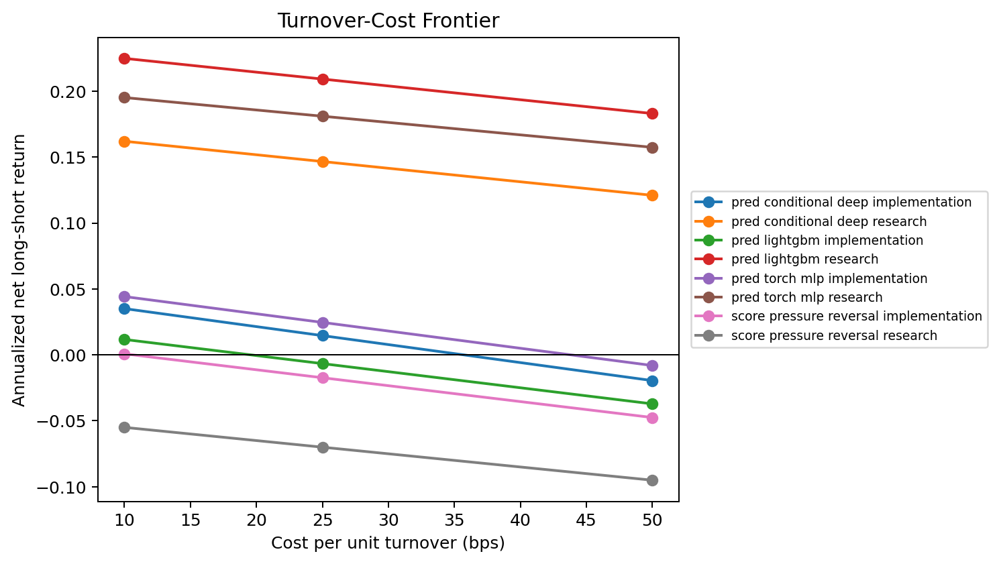
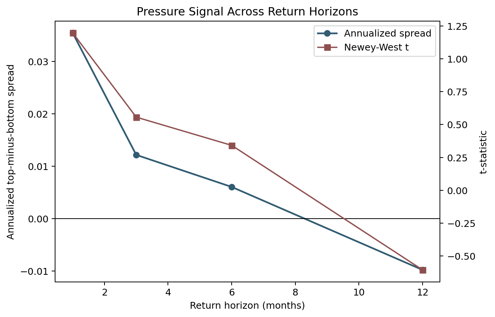
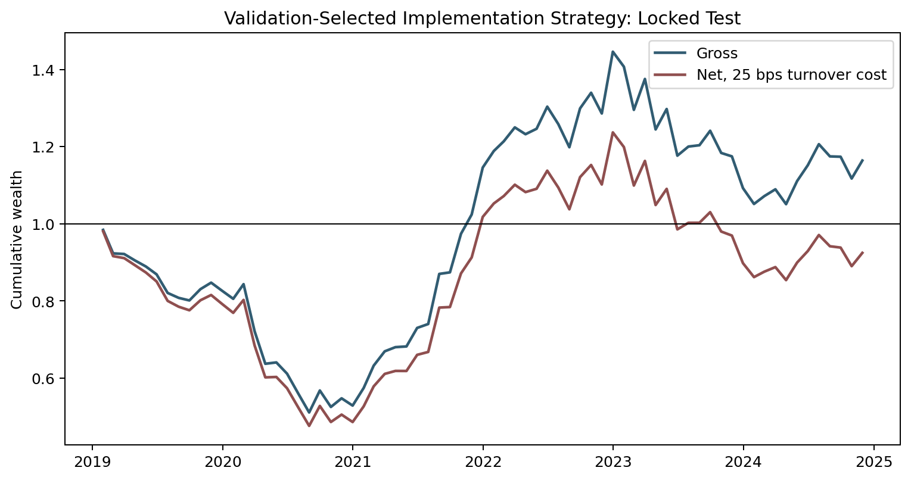

# instrumented-mutual-fund-fire-sale-pressure

[](pyproject.toml)
[](tests/)
[](mkdocs.yml)
[](sql/)

## Question

When mutual funds face predictable flow pressure, do their lagged holdings transmit that pressure into stock-level returns, and can the signal be used in modern return-prediction and portfolio tests?

## Answer

Yes, predictability in mutual-fund flow pressure is visible in a full WRDS/CRSP/Compustat stock-month panel and it improves return-ranking models. The strongest empirical layer is not a raw decile sort by itself; it is the full machine-learning and implementation pipeline: lagged holdings, forecastable flows, IV/DML checks, nonlinear ranking models, factor alphas, turnover costs, and capacity diagnostics.



## Headline Results

| Block | Result |
|---|---:|
| Full panel | 1,020,111 stock-months, 10,066 stocks, 2004-2024 |
| Pressure coverage | 95.4% of stock-months have mapped mutual-fund ownership pressure |
| Best locked-test rank IC | 5.82% from the conditional deep model |
| Best implementation portfolio alpha | FF5+UMD monthly alpha t-statistic of 4.78 |
| XGBoost implementation portfolio | 13.1% annualized mean, Sharpe 1.17 before costs |
| Validation-selected strategy audit | 0.9% annualized net return after 25 bps turnover cost in the locked test |

## Result Figures

<p>
  
  
</p>

<p>
  
  
</p>

<p>
  
  
</p>

## What This Builds

The repo implements an end-to-end empirical finance pipeline:

- WRDS schema audit and reproducible SQL extracts for CRSP mutual funds, CRSP stocks, CCM, Compustat, and Fama-French factors.
- Fund-flow measurement from TNA and returns, with capped realized flows and walk-forward predicted flows.
- Stock-level pressure from predicted fund flows multiplied by lagged mutual-fund holdings.
- Point-in-time stock-month features with CRSP delisting returns and six-month-lagged Compustat controls.
- Fama-MacBeth, IV 2SLS, DML IV, ablation, robustness, horizon, and bootstrap tables.
- Elastic Net, LightGBM with Optuna and SHAP, XGBoost, Torch MLP, and a conditional deep asset-pricing appendix model.
- Market-neutral long-short portfolios with max-name-weight, turnover, transaction-cost, factor-alpha, drawdown, and capacity diagnostics.

## Reproduce

Install the package in editable mode:

```bash
python -m pip install -e ".[ml,dev,docs]"
```

Run a local smoke test:

```bash
python scripts/001_smoke.py
```

Run the full pipeline on an approved compute allocation:

```bash
python scripts/002_full_pipeline.py --sample full
```

Build README-safe aggregate assets from a completed run:

```bash
python scripts/004_build_readme_assets.py --artifact-root reports/remote_proposal_grade
```

Run the release audit:

```bash
python scripts/003_release_audit.py --artifact-root reports/remote_proposal_grade
```

## Main Artifacts

| Path | Purpose |
|---|---|
| `src/mffiresale/` | production package for extraction, features, models, backtests, empirical tables, figures, and validation |
| `scripts/001_smoke.py` | small end-to-end smoke run |
| `scripts/002_full_pipeline.py` | full proposal-grade pipeline wrapper |
| `scripts/strategy_candidate_sweep.py` | validation-selected implementation strategy sweep |
| `configs/` | sample windows, WRDS table names, modeling windows, universe filters, and portfolio constraints |
| `sql/` | SQL templates for WRDS extracts |
| `jobs/` | SLURM allocation-safe wrappers for Amarel |
| `notebooks/` | thin review notebooks for schema, features, models, and figures |
| `docs/figures/` | publication-safe rendered figures used by the README |
| `docs/assets/tables/` | publication-safe aggregate tables used by the README |
| `tests/` | timing, linkage, model-window, backtest, and deliverable checks |

## Skills Demonstrated

Empirical asset pricing, WRDS data engineering, point-in-time panel construction, mutual-fund holdings joins, leakage-aware ML validation, GPU modeling, factor alpha attribution, implementation-aware portfolio testing, visual QA, and reproducible research packaging.

## Publication Boundary

The repository is designed to publish code, configs, SQL templates, docs, tests, notebooks, aggregate tables, and rendered figures. WRDS extracts, row-level processed panels, credentials, server logs, and trained binary model artifacts are kept outside the tracked release.
